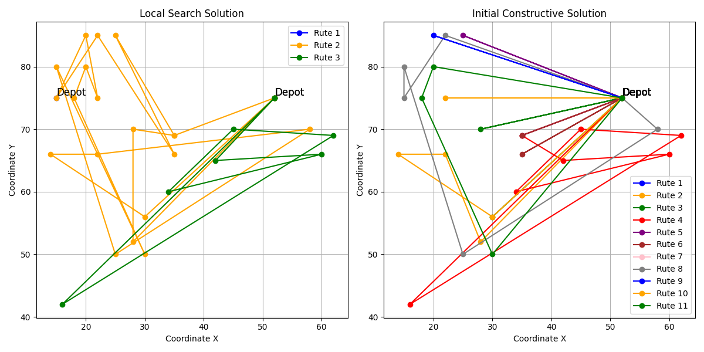
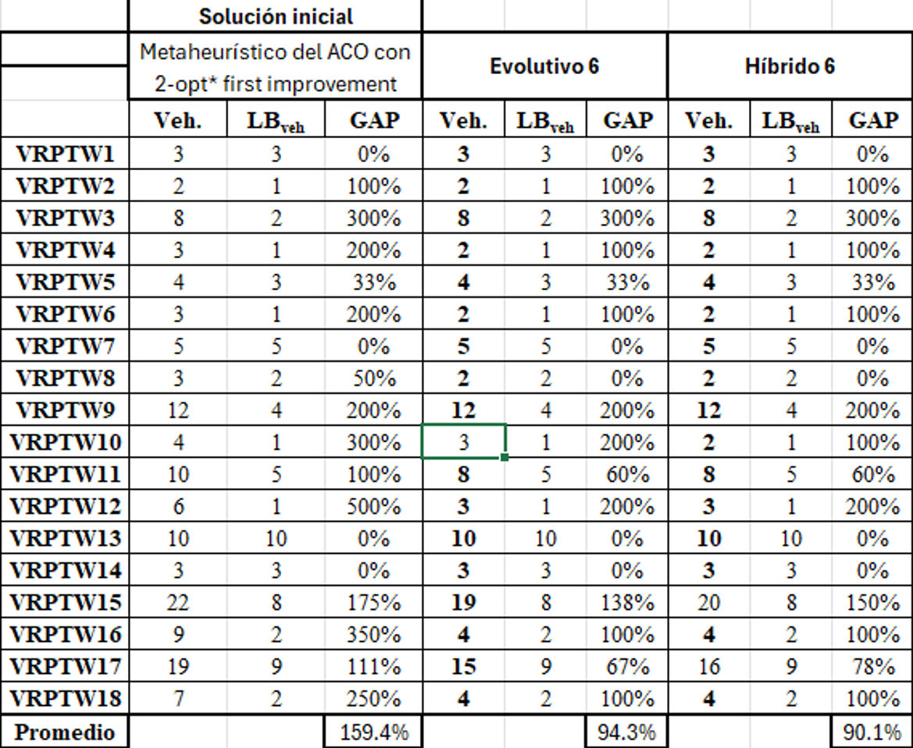

# VRPTW Heuristics

This repository contains solutions to the **Vehicle Routing Problem with Time Windows (VRPTW)**, utilizing various heuristic approaches to solve the problem. The goal of the project is to **minimize the number of vehicles** required to service all the customer locations, and in the case of ties (same number of vehicles), **minimize the total travel distance**.

The project consists of four main deliverables, each focusing on different algorithmic strategies. The aim is to explore various methods for solving this complex optimization problem using heuristics.

## Deliverables

1. **Trabajo1**: Three constructive algorithms for solving the VRPTW. These algorithms build an initial solution based on problem-specific constraints.
2. **Trabajo2**: Three local search algorithms aimed at improving the solutions obtained from Trabajo1. These techniques iteratively refine solutions to reduce cost or distance.
3. **Trabajo3**: Two metaheuristic algorithms for VRPTW. These are advanced techniques designed to explore the solution space more effectively and find near-optimal solutions.
4. **Trabajo4**: Implementation of an evolutionary algorithm and a genetic algorithm. These algorithms use natural selection-inspired mechanisms to search for optimal or near-optimal solutions to VRPTW.

### Visual Comparison

The image below illustrates the improvement achieved using local search. The initial constructive solution generated 11 routes, whereas the local search approach reduced this to only 3 routes:

<p align="center">
  
</p>

### Performance Summary

The table below summarizes the performance of the best evolutionary and hybrid algorithms implemented in Trabajo4. The `Veh.` column shows the number of vehicles used, and the `GAP` column indicates the percentage difference from the lower bound:

<p align="center">
  
</p>

## Setup

To work with the project, navigate to the respective folder for each deliverable:

1. Clone the repository:
```
git clone https://github.com/your-username/VRPTW-Heuristics.git
```

2. Navigate to the folder for each deliverable:
```
cd Trabajo1
```

Each deliverable contains:

- Code: The implemented algorithms in C++.
- Presentation: An explanation of the approach and theoretical background.
- Solutions: Results and analysis of the algorithm's performance.

## License
This repository is open-source and available under the MIT License.
